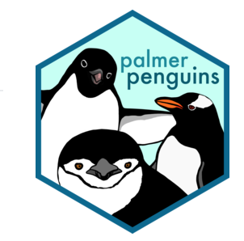

# palmerpenguin-streamlit-eda <a href='https://allisonhorst.github.io/palmerpenguins'></a>

Self-exploratory Streamlit app to know more about palmer penguins. 


> The data was collected and made available by [Dr. Kristen Gorman](https://www.uaf.edu/cfos/people/faculty/detail/kristen-gorman.php) and [Palmer Station, Antarctica, LTER.](https://pal.lternet.edu/)


## Sneak Peek


## Requirements

* python 3.7 version
* streamlit 0.60 version
* pandas
* numpy
* seaborn
* matplotlib

## Usage Description for Local Run

+ Install streamlit and other dependencies as mentioned in **Requirements**
+ Clone the repository: ```git clone https://github.com/narayansharma275/streamlitapp.git```
+ Run as ```streamlit run app.py```
+ 
**Any feedbacks and suggestions are highly appreciated.**
